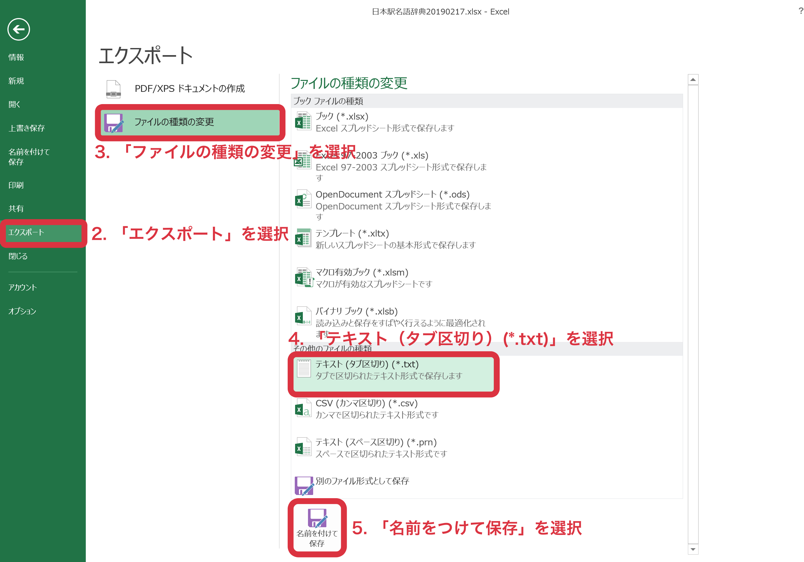

# parody
## 1. 概要
- これは `python3` で記述された，駅名替え歌などの替え歌を自動で作詞するプログラムです。
- 現在は，駅名替え歌のみに対応しています。
- 動作は `macOS 10.13.6`, `python3.7.3`, MicrosoftExcel2013 で確認しています。その他の環境での動作は保証できません。Mac または Ubuntu 上での実行を推奨します。
- このプログラムは駅名データとして，想像地図研究所様の「[日本駅名語辞典][1]」を使用します。**ご使用の際は[こちら][1]の「利用について」の項目をよくお読みください。**
[1]:http://souzoumap.webcrow.jp/Taosenai/Ekimeigojiten.HTM

## 2. 必要なパッケージのインストール，データの用意
### 2.1 パッケージの用意
- このリポジトリを次のコマンドでクローンします (例えば，ホームディレクトリ `~/` の直下など)。
  - `git clone https://github.com/Ryo-Kashimura/parody`
  - **以下，ホームディレクトリにの直下にこのレポジトリをクローンしたものとして説明を進めます。** その他の場所にクローンした場合は適宜ディレクトリやファイルのパスを読み替えてください。
- `~/parody/bin/requirements.txt` に記述されたパッケージを事前にインストールする必要があります。
- `pip -r ~/parody/bin/requirements.txt` 等のコマンドでインストールできます。
### 2.2 駅名データの用意
#### 2.2.1 駅名データのダウンロード
1. [こちら][link]より `.zip` ファイルをダウンロードできます。 **ご使用の際は「利用について」の項目をよくお読みください。**
2. ファイルをダウンロードした後，それを展開すると，`日本駅名語辞典の注意事項YYYYMMDD.txt`，`日本駅名語辞典YYYYMMDD.xlsx` (`YYYY`: 年, `MM`: 月, `DD`: 日) というファイルを得られます。
  - 例) `日本駅名語辞典の注意事項20190217.txt`，`日本駅名語辞典20190217.xlsx`
  - [日本駅名語辞典][link]は年数回更新されます。そのためファイル名の年月日の部分 (`YYYYMMDD`) は時期により異なりますので，適宜読み替えてご利用ください。
#### 2.2.2 `.tsv` ファイルへの変換 
- **このステップでは，Microsoft Excel によるファイルの編集を前提としています。** ご注意ください。
1. まず，ファイル `日本駅名語辞典YYYYMMDD.xlsx` を Microsoft Excel で開き，左上の「ファイル」を選択します。

2. 次に，「エクスポート」，「ファイルの種類の変更」，「テキスト（タブ区切り）(\*.txt)」の順に選択します。

3. ファイルを `.txt` ファイルとして保存します。
4. 作成したファイルの名前を `station_dictionary_YYYYMMDD.tsv` に変更します。
  - 例) `station_dictionary_20190217.tsv`
5. ファイル `station_dictionary_YYYYMMDD.tsv` をディレクトリ `~/parody/data/station/` に配置します。

## 3. 使い方
### 3.1 元の歌の歌詞の準備
- 替え歌の元となる歌詞を **ひらがな** で `.txt` ファイルに記述し， `~/parody/data/lyrics/` に置いてください。
- 歌詞の記述の際，歌詞を文節に区切ってそれぞれの間に半角スペースを挟むことを推奨します。
### 3.2 実行
1. ディレクトリ `~/parody/bin/` (`.py` ファイルのあるディレクトリ) に移動
  - 例) `cd ~/parody/bin/`
2. `python ./search_station_path.py --verbose --lyrics_filename 元の歌詞のファイル名 替え歌のファイル名` を実行 (20 - 30 分ほどかかるかもしれません)
  - 例) `python ./search_station_path.py --verbose --lyrics_filename 故郷.txt station_parody_故郷.tsv`
  - 元の歌詞のファイルは `.txt` ファイル，替え歌のファイルは `.tsv` ファイルである必要があります。
### 3.3 出力ファイルの閲覧
- 出力ファイルは `~/parody/result/parody/`  以下に `.tsv` ファイルとして保存されます。
- ファイルはテキストエディタでも閲覧できますが，Microsoft Excel または Numbers などのアプリケーションの方が見やすいです。
### 3.4 オプション機能
- 実行中に替え歌の進捗を見たい場合は実行コマンドに `--verbose` オプションをつける必要があります。
- 元の歌詞は `.txt` ファイルとして用意する他に， `--lyrics` オプションを使うこともできます。
  - 例) `python ./search_station_path.py --verbose --lyrics 'うさぎ おいし かの やま' example_parody.tsv`
- デフォルトでは，同じ駅を重複して使用しません。重複を許す場合は， `~/parody/data/hparams/hparams_v1.json` を編集し， `"repeated": false` を `"repeated": true` に変更してください。
- デフォルトでは，廃止された駅を使用しません。廃止駅を使用する場合は， `~/parody/data/hparams/hparams_v1.json` を編集し， `"no_deprecated": true` を `"no_deprecated": false` に変更してください。
  
## 4. 注意事項
- 現在のところ，元となる歌詞は **すべてひらがなで** 記述する必要があります。
- 入力となる，元の歌詞に改行を挟むと，出力となる替え歌の歌詞の単語は必ずその場所で分割されます。
- 入力となる，元の歌詞に半角スペースを挟むと，出力となる替え歌の歌詞の単語は分割されやすいです (確実ではありません)。
- 入力の歌詞に関しては， **全角スペースを含めて，ひらがな以外の文字には一切対応しておりません** ので，ご注意ください。
